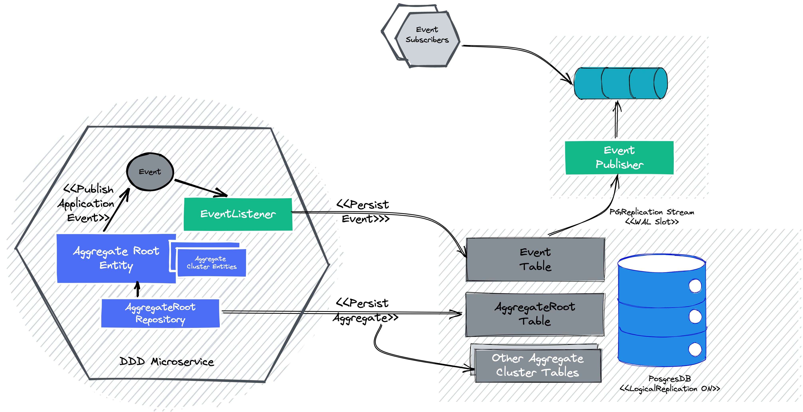

# Transactional Outbox - Using Postgres Logical Replication 

## High Level Idea



More docs to come...

## How to Run this Proof of Concept

- Go to _docker folder and start-up the docker-compose file. This starts Postgres, Kafka and Zookeeper. 
- Start the Account MS as a Spring Boot Application. This initializes the account schema as well.
- Start the EventPublisher MS as a Spring Boot Application.
- Fire a CURL (Sample given below) and watch Kafka Topic to see the messages flowing in.


## Sample CURL Request

```curl
curl -X POST --location "http://localhost:8081/api/account" \                                                                                                                                                 6 ✘  at 23:27:48  
  -H "Content-Type: application/json" \
  -d "{
        \"accountNumber\": \"123345678\",
        \"customerId\": \"12345\",
        \"accountType\": \"CHECKING\",
        \"initialDeposit\": 12.30
      }"
```

## Sample Kafkacat To Listen to Events

```sh
kafkacat -b localhost:9092 -t account.event
```

## Appendix

### Useful PostgresSQL Commands

- Create a logical replication slot

```sql
SELECT * FROM pg_create_logical_replication_slot('test123', 'pg_output');
```

- Select the logical replication slots

```sql
select * from pg_replication_slots;
```

- Drop already existing logical replication slot

```sql
select pg_drop_replication_slot('alltable_slot');
```

- Create a publication for all tables

```sql
CREATE PUBLICATION alltables FOR ALL TABLES;
```

- Create a publication for only a particular table

```sql
CREATE PUBLICATION eventpub FOR TABLE account.event;
```

- Create a publication for only inserts events of a particular table

```sql
CREATE PUBLICATION eventpub2 FOR TABLE account.event WITH (publish = 'insert');
```

- Select an existing publication by name
```sql
SELECT * from pg_publication where pubname='eventpub';
```

### Useful Links

- https://github.com/pgjdbc/pgjdbc/issues/1147
- https://www.postgresql.org/docs/current/protocol-logicalrep-message-formats.html
- Great explanation and useful code:
  - https://github.com/davecramer/LogicalDecode